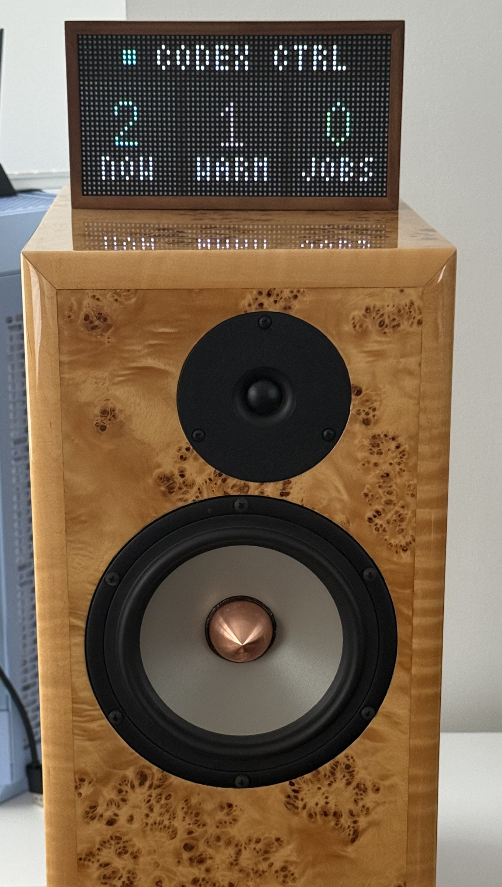
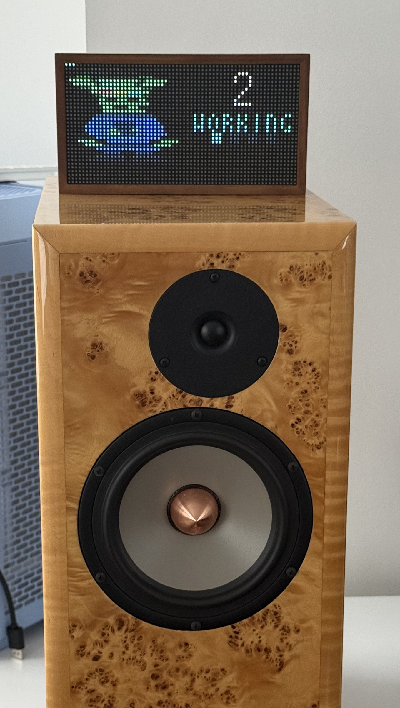
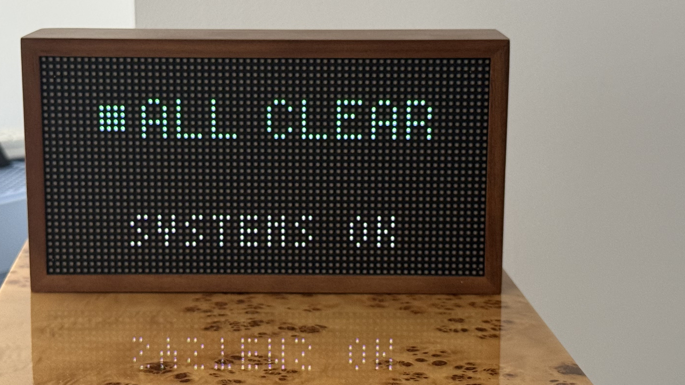
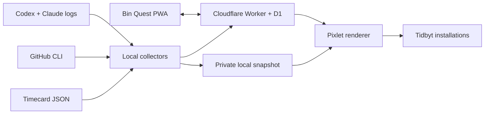

# Tidbyts — A quiet status wall for Codex

[](https://github.com/joncooper/tidbyts/actions/workflows/ci.yml)
[](LICENSE)

*When something needs me, I just look up.*

I still love these little screens, so I gave four of them a second life. They
show what Codex is doing, what just finished, how the computer is doing, and the
one problem that needs me. No phone, no dashboard, no notification in my pocket.

Codex has two jobs in this project. It helped me build Tidbyts, then became the
recurring local automation that checks the system and refreshes the wall. A
small Cloudflare service handles only content-free usage records, pull-request
totals, and the household score.

## The displays

<table>
  <tr>
    <td width="50%" valign="top">
      <br>
      <strong>Codex Control Tower</strong><br>
      Shows what Codex is doing now, what recently finished, which background
      jobs are running, and whether a task needs me. When one does, the whole
      screen becomes the alert.
    </td>
    <td width="50%" valign="top">
      <br>
      <strong>Glint</strong><br>
      Glint works when Codex works, waits when it needs me, and celebrates a
      finish. Its animation stays restrained enough to live in the room.
    </td>
  </tr>
  <tr>
    <td width="50%" valign="top">
      <br>
      <strong>Billable Week</strong><br>
      Reads the local Timecard data file and shows the active timer, hours left,
      or the amount over goal. Crossing the weekly target gets a brief victory
      state.
    </td>
    <td width="50%" valign="top">
      <br>
      <strong>Exception Screen</strong><br>
      Quiet when everything is healthy; blunt when it is not. Alerts get the
      whole screen and rotate one at a time, ordered by severity. It watches
      collector runs, GitHub Actions, disk space, Worker health, PR freshness,
      optional endpoints, and an optional AWS budget.
    </td>
  </tr>
  <tr>
    <td width="50%" valign="top">
      <br>
      <strong>Landed PRs</strong><br>
      Pull requests merged into a GitHub repository over the trailing 24 hours,
      7 days, and 30 days.
    </td>
    <td width="50%" valign="top">
      <br>
      <strong>Token Use</strong><br>
      Thirty-day Codex and Claude usage as aligned odometers. The digits are
      expressed in millions so the two providers remain readable at a glance.
    </td>
  </tr>
  <tr>
    <td colspan="2" align="center" valign="top">
      <br>
      <strong>Bin Quest</strong><br>
      A deliberately cheerful household scoreboard for working through bins of
      accumulated stuff. A small phone-friendly PWA handles updates.
    </td>
  </tr>
</table>

The screenshots are generated from the actual Pixlet apps with
[`scripts/generate-readme-assets.sh`](scripts/generate-readme-assets.sh). They
are enlarged with nearest-neighbor scaling; no design mockups are standing in
for the real 64×32 output.

## On the wall

These are the same views running on real Tidbyt hardware in my office. The
software renders are useful for inspection; the photographs show the actual
ambient scale and the restraint of the displays in the room.

<table>
  <tr>
    <td width="50%" valign="top">
      <br>
      A local Codex automation keeps this Tidbyt current.
    </td>
    <td width="50%" valign="top">
      <br>
      Glint shows when work is moving without opening another dashboard.
    </td>
  </tr>
  <tr>
    <td colspan="2" align="center" valign="top">
      <br>
      When nothing needs attention, the display stays calm.
    </td>
  </tr>
</table>

## Build Week judge demo

The Worker serves a hardware-free interactive product tour at `/demo/`. It uses
the same Pixlet output shown above, needs no account or private metrics, and lets
reviewers switch through the developer-tool states without owning a Tidbyt. The
committed source is in [`public/demo/`](public/demo/index.html); deployment makes
the same route publicly accessible. The complete submission copy, evidence
checklist, and testing instructions live in
[`docs/build-week-submission.md`](docs/build-week-submission.md).

[Watch the 2:41 demo film: **I Gave Codex Four Tiny Screens**](https://youtu.be/Xzd62OyThJ4).

## Built with Codex, kept current by Codex

**Tidbyts — A quiet status wall for Codex** is a Developer Tools entry for
OpenAI Build Week. I built it with Codex Desktop and GPT-5.6 Sol in the July 18
core-build session `019f76ab-6b0a-7d73-a7dd-7e3bc30bb31f`; the session metadata
records `gpt-5.6-sol`. Codex helped me connect the collectors, Worker/D1 path,
and Pixlet apps, then test working, ready, healthy, and failure states at the
real 64×32 resolution.

I made the product calls: private work stays local, an exception earns the whole
screen, and every view has to make sense from across the room. Codex then takes
on its second job. In normal use, a continuing local automation runs the refresh
loop every fifteen minutes. I can teach that same task another check as my setup
changes without making the displays any busier.

**Built with:** Codex Desktop, GPT-5.6 Sol, TypeScript, Cloudflare Workers, D1,
Pixlet, Starlark, Vitest, and Wrangler.

## How it works



There are two data paths:

- Shared state—small usage records, pull-request totals, and explicitly entered
  Bin Quest progress—lives in D1 and is served by a Cloudflare Worker.
- Machine-local state—Codex activity, Timecard, disk space, and refresh health—
  stays in an ignored local snapshot and goes directly into Pixlet.

Each render is pushed with a stable installation ID, so rerunning the updater
replaces the existing image instead of filling the device with duplicates. The
apps can share one rotation or be assigned to dedicated displays.

## Design choices

**No subscription dependency.** This does not use Tidbyt Plus or Teams. Pixlet
runs locally and pushes completed WebP animations through the device API.

**Stock firmware is fine.** Nothing here requires flashing the display. The
same rendering pipeline can move to community firmware later if that becomes
the better home for the hardware.

**Private by default.** Tidbyts never copies prompts, code, transcript text,
tool calls, file paths, PR titles, or PR bodies into its Worker, D1 database, or
Tidbyt payloads. The Worker receives small usage records—timestamps,
provider/model identifiers, and token counts—plus PR totals and explicitly
entered Bin Quest progress. Usage rows are aggregated when the dashboards read
them.

**Failures should still be visible.** Refresh steps are independent. If a data
collector fails, later safe steps continue so Exception Screen can report the
failure instead of silently leaving an old dashboard in place.

**The pixels are the constraint.** Every state has a fixed character budget and
a render test, including long labels and two-digit extremes. Animation is used
to communicate state, not to make a tiny display busier.

## Running it

The full local setup is tested on macOS with Codex Desktop, Node.js 22+,
[Pixlet](https://github.com/tidbyt/pixlet), `jq`, `sqlite3`, Wrangler, and an
authenticated GitHub CLI. A live installation also needs a Cloudflare account
and Tidbyt device API key. The Worker and hardware-free demo work in any modern
browser.

```bash
npm install
cp .env.example .env.local
```

Create a D1 database, put its ID in `wrangler.jsonc`, apply the migration, and
configure the three Worker secrets:

```bash
npx wrangler d1 create tidbyts
npm run db:migrate:remote
npx wrangler secret put READ_TOKEN
npx wrangler secret put INGEST_TOKEN
npx wrangler secret put HOUSEHOLD_TOKEN
npm run deploy
```

Fill in `.env.local` with the Worker URL, matching ingest/read tokens, and the
device ID and API token. Then run one complete refresh:

```bash
./scripts/refresh.sh
```

In my normal setup, one Codex Desktop automation runs every fifteen minutes.
Keeping the updater in the same continuing task means I can keep teaching it
what to watch as the system evolves. A conventional scheduler can run the same
refresh script if preferred. The four prototype roles also accept individual
device IDs and device-scoped tokens when each dashboard gets its own display.

Bin Quest's mobile UI is served from the same Worker. A one-time setup URL puts
the household token in the URL fragment, stores it locally, and removes it from
the address bar before normal use.

## Development

Judges can run the static demo without rebuilding any Pixlet assets:

```bash
npm ci
npm run dev
# open http://localhost:8787/demo/
```

The checked-in demo assets are ready to use; a Tidbyt, API credential, and
local Codex history are not required for this review path.

```bash
npm run types
npm run typecheck
npm test
npm run test:pixlet
npm run cf:dry-run
```

`npm test` runs the Worker against an isolated local D1 database. The Pixlet
suite renders normal, event, alert, and maximum-width states for all four local
dashboards. README images are reproducible with:

```bash
npm run docs:screenshots
```

Secrets and generated runtime data are ignored by Git. See `.env.example` and
`.dev.vars.example` for the complete configuration surface.

## License

MIT © 2026 Jon Cooper
