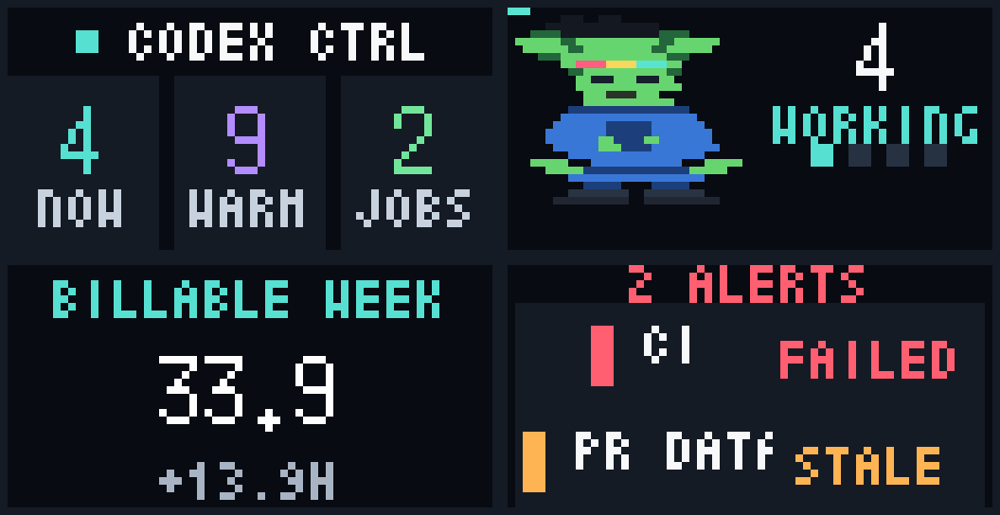
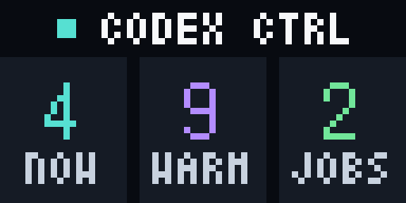
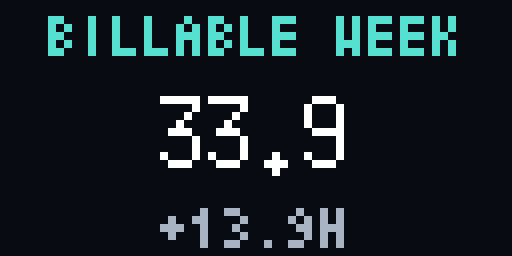
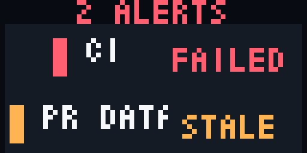
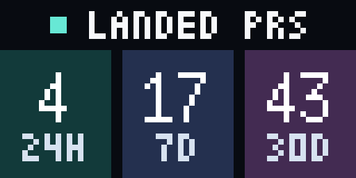
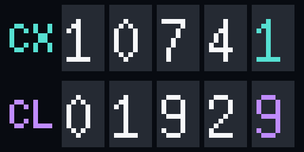
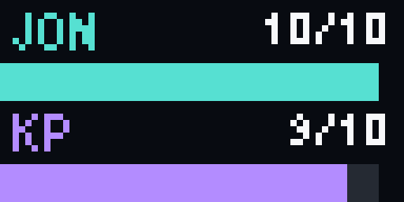
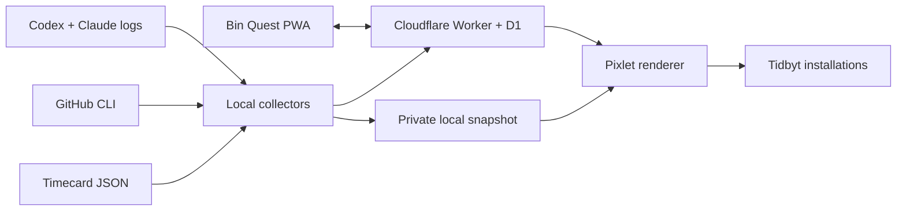

# Tidbyts

[](https://github.com/joncooper/tidbyts/actions/workflows/ci.yml)
[](LICENSE)

Private, subscription-free dashboards for the original 64×32 Tidbyt display.



I have four Tidbyts, and I still like the hardware. When the hosted ecosystem
became uncertain, I wanted a way to keep the displays useful without paying for
private-app hosting or replacing working firmware.

This repository is the system I ended up building. It renders Pixlet apps on my
Mac, pushes them as ordinary installations, and uses a small Cloudflare Worker
and D1 database when data needs to move between devices. The result feels like
a tiny ambient operations wall: code activity, shipped work, billable time,
household projects, and the handful of exceptions that actually need attention.

## The displays

<table>
  <tr>
    <td width="50%">
      <br>
      <strong>Codex Control Tower</strong><br>
      Exact active, ready-for-me, recent, and batch-job state. If something
      needs a response, the entire screen becomes the alert.
    </td>
    <td width="50%">
      <br>
      <strong>Glint</strong><br>
      A small ambient companion with different behavior for idle, working,
      ready, completed, and shipped states. The completion animation zooms in
      instead of trying to depict tiny keyboard movements.
    </td>
  </tr>
  <tr>
    <td width="50%">
      <br>
      <strong>Billable Week</strong><br>
      Reads the local Timecard data file and shows the active timer, hours left,
      or the amount over goal. Crossing the weekly target gets a brief victory
      state.
    </td>
    <td width="50%">
      <br>
      <strong>Exception Screen</strong><br>
      Quiet when everything is healthy; blunt when it is not. It watches
      collector runs, GitHub Actions, disk space, Worker health, PR freshness,
      optional endpoints, and an optional AWS budget.
    </td>
  </tr>
  <tr>
    <td width="50%">
      <br>
      <strong>Landed PRs</strong><br>
      Pull requests merged into a GitHub repository over the trailing 24 hours,
      7 days, and 30 days.
    </td>
    <td width="50%">
      <br>
      <strong>Token Use</strong><br>
      Thirty-day Codex and Claude usage as aligned odometers. The digits are
      expressed in millions so the two providers remain readable at a glance.
    </td>
  </tr>
  <tr>
    <td colspan="2" align="center">
      <br>
      <strong>Bin Quest</strong><br>
      A deliberately cheerful household scoreboard for working through bins of
      accumulated stuff. A small phone-friendly PWA handles updates.
    </td>
  </tr>
</table>

The screenshots are generated from the actual Pixlet apps with
[`scripts/generate-readme-assets.sh`](scripts/generate-readme-assets.sh). They
are enlarged with nearest-neighbor scaling; no design mockups are standing in
for the real 64×32 output.

## How it works



There are two data paths:

- Shared state—PR counts, aggregate token usage, and Bin Quest—lives in D1 and
  is served by a Cloudflare Worker.
- Machine-local state—Codex activity, Timecard, disk space, and refresh health—
  stays in an ignored local snapshot and goes directly into Pixlet.

Each render is pushed with a stable installation ID, so rerunning the updater
replaces the existing image instead of filling the device with duplicates. The
apps can share one rotation or be assigned to dedicated displays.

## Design choices

**No subscription dependency.** This does not use Tidbyt Plus or Teams. Pixlet
runs locally and pushes completed WebP animations through the device API.

**Stock firmware is fine.** Nothing here requires flashing the display. The
same rendering pipeline can move to community firmware later if that becomes
the better home for the hardware.

**Private by default.** Prompts, code, transcript text, tool calls, file paths,
PR titles, and PR bodies never leave the Mac. The Worker receives timestamps,
provider/model identifiers, aggregate token counts, and PR totals.

**Failures should still be visible.** Refresh steps are independent. If a data
collector fails, later safe steps continue so Exception Screen can report the
failure instead of silently leaving an old dashboard in place.

**The pixels are the constraint.** Every state has a fixed character budget and
a render test, including long labels and two-digit extremes. Animation is used
to communicate state, not to make a tiny display busier.

## Running it

You will need Node.js 22+, [Pixlet](https://github.com/tidbyt/pixlet), Wrangler,
an authenticated GitHub CLI, a Cloudflare account, and a Tidbyt device API key.

```bash
npm install
cp .env.example .env.local
```

Create a D1 database, put its ID in `wrangler.jsonc`, apply the migration, and
configure the three Worker secrets:

```bash
npx wrangler d1 create tidbyts
npm run db:migrate:remote
npx wrangler secret put READ_TOKEN
npx wrangler secret put INGEST_TOKEN
npx wrangler secret put HOUSEHOLD_TOKEN
npm run deploy
```

Fill in `.env.local` with the Worker URL, matching ingest/read tokens, and the
device ID and API token. Then run one complete refresh:

```bash
./scripts/refresh.sh
```

The updater can run from any scheduler. My setup uses a dedicated 15-minute
Codex desktop automation, so it stays in one task over time and does not require
a LaunchAgent. The four prototype roles also accept individual device IDs and
device-scoped tokens when each dashboard gets its own display.

Bin Quest's mobile UI is served from the same Worker. A one-time setup URL puts
the household token in the URL fragment, stores it locally, and removes it from
the address bar before normal use.

## Development

```bash
npm run types
npm run typecheck
npm test
npm run test:pixlet
npm run cf:dry-run
```

`npm test` runs the Worker against an isolated local D1 database. The Pixlet
suite renders normal, event, alert, and maximum-width states for all four local
dashboards. README images are reproducible with:

```bash
npm run docs:screenshots
```

Secrets and generated runtime data are ignored by Git. See `.env.example` and
`.dev.vars.example` for the complete configuration surface.

## License

MIT © 2026 Jon Cooper
